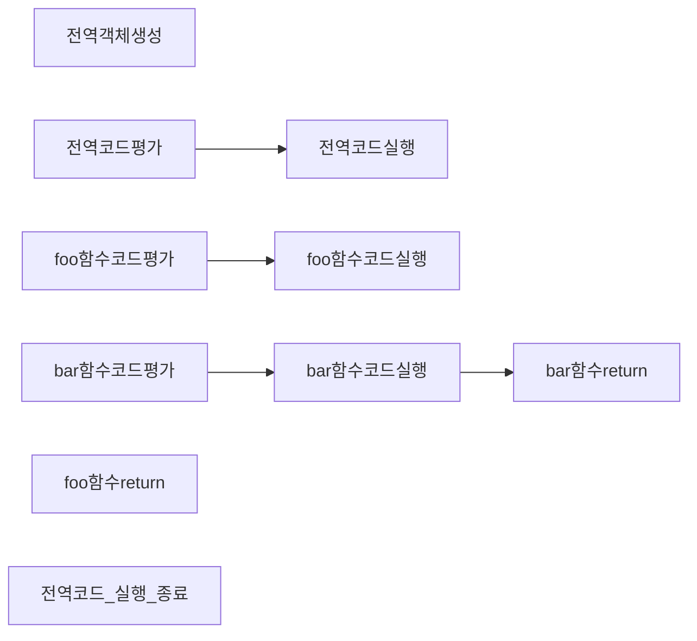

프로그램과 프로세스의 차이 

프로그램  -  
프로세스  -

```javascript
console.log('hello world!')
```


javascript --> 실행컨텍스트


## 실행컨텍스트 구체화하기

```javascript
var a = 10
console.log(a)
```

`평가`
`실행`

```javascript
var a 
```


```yaml
a : undfiend 

```


```javascript
var a = 10
console.log(a)
```

```
a : 10
```


콜스택 <-- 


연산자 
1+1 
2-2
3/3
3%3

1 < 2
2 > 1


## 실행 컨텍스트의 역활


코드가 실행 되려면 스코프, 식별자, 코드 실행 순서 등의 관리가 필요하다.
1. 선언에 의해 생성된 모든 식별자를 스코프를 구분하여 등록하고 상태 변화를 지속적으로 관리
2. 스코프는 중첩관계에 의해 스코프 체인을 형성해야 함 스코프 체인을 통해 상위 스코프로 이동하며 식별자를 검색할 수 있어야 한다.
3. 현재 실행 중인 코드의 실행 순서를 변경(함수 호출에 의해 순서변경) 할 수 있어야 하며 다시 돌아갈 수 있게 해야한다.

즉 이 모든 것을 관리하는 것을 `실행 컨텍스트` 가 하는 일이다.

> 코드의 실행환경에 대한 여러가지 정보를 담고있는 개념 런타임에 의해 코드정보를 담고있는 객체 

#### 실행컨텍스트란 ?

소스코드 실행하는데 필요한 환경을 제공하고, 코드의 실행 결과를 보장하는 관리 영역

- 식별자 (변수, 함수, 클래스) 를 등록하고 관리하는 스코프
- 실행순서관리를 구현한 내부 매커니즘 이다.
- 모든 코드는 실행 컨텍스트를 통해 실행되고 관리된다.

> 렉시컬 환경 은 식별자와 스코프를 관리
> 실행 컨텍스트 스택은 코드 실행 순서를 관리

실행컨텍스트 모양 새는 다음과 같다.

```
Global Execution Context

- Lexical Environment 
	- EnvironmentRecord
		- Object EnvironmentRecord
		- Declarative EnvironmentRecord
	- this Binding
	- Outer EnvironmentReference
- VariableEnvironment


Function Execution Context

- Lexical Environment
	- EnvironmentRecord
	- This Binding
	- Outer EnvironmentReference
- VariableEnvironment
```

```javascript
var a = 10
console.log(a)
```
평가

```json
{
	Lexical Record : {
		a: undfiend
	}
	this binding : {}
	outer environment : {}
}

```

실행

```json
{
	Lexical Record : {
		a: 10
	}
	this binding : {}
	outer environment : {}
}

```


> EC : Execution Context
> LE : LexicalEnvironment
> VE : VariableEnvironment
> Env.Rec : EnvironmentRecord
> OutEnv.Ref OuterEnvironmentReference

## 소스코드의 평가와 실행

모든 소스코드는 실행에 앞서 평가과정을 거쳐 코드를 실행하기 위한 준비과정을 거친다.
- 소스 코드는 소스코드 평가와, 소스코드 실행 단계의 과정으로 나누어 처리된다.


1. 소스코드 평가 과정
	1. 실행 컨텍스트 생성
	2. 변수, 함수 등의 선언문만 먼저 실행
	3. 생성된 변수, 함수 식별자를 실행 컨텍스트가 관리하는 스코프 (렉시컬 환경 레코드) 에 등록
2. 소스코드 실행
	1. 소스코드 평가가 끝난 다음에 순차적으로 실행됨 (런타임이라고 함)
	2. 실행에 필요한 정보(변수나 함수 참조를 실행컨텍스트가 관리하는 스코프에서) 검색해 취득
	3. 변수 값의 변경 등 소스코드의 실행 결과는 다시 실행컨텍스트가 관리하는 스코프에 등록
	4. 


## 실행 컨텍스트 스택 (콜스택)

코드의 순서를 관리한다.
- 소스코드가 평가되면 실행 컨텍스트가 생성되고 실행 컨텍스트 스택의 최상위로 쌓인다.
- 최상위 실행 컨텍스트는 언제나 현재 실행 중인 컨텍스트이다. (실행 중인 실행 컨텍스트(running execution context)

자바스크립트 엔진은
1. 먼저 전역 코드를 평가하여 전역 실행 컨텍스트를 생성한다.
2. 함수가 호출되면 함수 코드를 평가하여 함수 실행 컨텍스트를 생성한다.

`전역, 함수 실행 컨텍스트`는 `스택 자료구조`로 관리된다.
이 모든 과정을 `실행 컨텍스트 스택` 이라고 한다.


## 렉시컬 환경

식별자와 식별자에 바인딩된 값, 그리고 상위 스코프에 대한 참조를 기록하는 자료구조 실행 컨텍스트를 구성하는 컴포넌트이다.

- 스코프와 식별자를 관리한다.
- 스코프를 구분하여 식별자에 등록하고 관리하는 저장소 역활을 하는 렉시컬 스코프의 실체이다.
- Environment Record 와 Outer EnvironmentReference 컴포넌트로 구성되어있다. 


## 실행 컨텍스트 생성과 식별자 검색 과정

```javascript
var x = 1
var y = 2

function foo(a){
	var x = 3
	var y = 4

	function bar(b) {
		const z = 5
		console.log(a + b+ x+ y+ z)
	}
	bar(10)
}

foo(20)
```


프로그램 --> 런타임 --> 프로세스


위와 같은 코드를 실행 컨텍스트 의 과정을 나타내면




### 1. 전역객체 생성

```yaml
Global Execution Context

- Lexical Environment 
	- EnvironmentRecord
		- Object EnvironmentRecord
		- Declarative EnvironmentRecord
	- this Binding
		- this
	- Outer EnvironmentReference
- VariableEnvironment
```


전역객체 생성이라는 단계는 
`런타임`에 의해 생성된 글로벌 객체를 말한다.

javascript는 우리가 배운것을 토대로 언어이며,
이 언어를 실행시켜주는 도구가 런타임이다.

우리가 배운 런타임은 총 2가지가있다. 
`노드제이에스`, `브라우저` 

각각의 런타임에서는 전역객체 이름이 다른데 
브라우저 - window
노드제이에스 - global 

이라고한다. 

쉽게 생각해서 전역객체 생성이라는 단계는 우리가 만든코드를 실행하기전
런타임이 만들어준 객체 라고 생각하면 편할거같다.

그리고 이제 우리가 만든 프로그램을 실행하여, 결과물을 봐야하는데.
이것을 관리하는것이 실행컨텍스트이며, 처음으로 생성되는 실행컨텍스트가 

글로벌 실행컨텍스트 이다 
그래서 글로벌 실행컨텍스트 모양을 보면
this 바인딩이라는 영역이 존재하는데. 

this 바인딩에 글로벌객체를 넣어준다는 뜻이다. 

간혹 우리가 이런 코드를 작성해본적이있다.

```javascript

console.log(this===window) // 결과물은..?

```

잘모른다면 글로벌 실행컨텍스트 를 그려가면서 이해를 해야한다. 
그런데 간혹 this 에 전역객체를 넣고싶지 않을때가 존재한다.
그때 쓰는 키워드가 `use strict`  라는 것을 사용하게 되는데.

이 키워드를 사용하게되면 
글로벌 실행컨텍스트에 this binding 부분에 전역객체가 들어가지 않게 된다.

그래서 이런 코드를 본적이있을것이다.

```javascript
'use strict'
console.log(this === global) // 결과물은..?
console.log(this) // 결과물은 ?
```


아무튼 전역객체 생성 단계에서는 우리는 
작성된 코드를 실행하기위헤 런타임이 만들어준 객체이다 라고 생각하면된다. 이제갓 런타임이 실행되었다. 


## 전역코드 평가 --> 전역코드 실행

```javascript
var x = 1
var y = 2

function foo(a){
	var x = 3
	var y = 4

	function bar(b) {
		const z = 5
		console.log(a + b+ x+ y+ z)
	}
	bar(10)
}

foo(20)
```

우리가 작성한 코드에서 전역코드란 무엇인가 ?

```javascript
var x = 1
var y = 2

function foo(a){}

foo(20)
```

아마 이부분과 같을것이다. 


1. 전역 실행 컨텍스트를 실행한다

```yaml
Global Execution Context

- Lexical Environment 
	- EnvironmentRecord
		- Object EnvironmentRecord
		- Declarative EnvironmentRecord
	- this Binding
	- Outer EnvironmentReference
- VariableEnvironment
```


2. 전역 렉시컬 환경을 생성한다.
```yaml
- "Lexical Environment"
	- EnvironmentRecord
		- Object EnvironmentRecord
		- Declarative EnvironmentRecord
	- this Binding
	- Outer EnvironmentReference
- VariableEnvironment
```

그리고 `전역 환경 레코드 생성` 한다 

```yaml
- "Lexical Environment"
	- "EnvironmentRecord"
		- Object EnvironmentRecord
		- Declarative EnvironmentRecord
	- this Binding
	- Outer EnvironmentReference
- VariableEnvironment
```

전역 환경 레코드 생성할때 전역코드에 있는 정보를 각각 알맞는 공간에 담는다.

저는 편의상 

- Object EnvironmentRecord
- Declarative EnvironmentRecord


이 두가지를 굳이 설명하지 않겠습니다. 없어도 되거든요!

그럼

```yaml
- "Lexical Environment"
	- "EnvironmentRecord"
	- this Binding
	- Outer EnvironmentReference
- VariableEnvironment
```

이 3개만 신경쓰면 됩니다!


우리가 흔히알고있는 호이스팅이 안일어나는 식별자
let, const, class


호스팅이 일어나는 식별자
function ,var 


```javascript
var x = 1
var y = 2

function foo(a){
	var x = 3
	var y = 4

	function bar(b) {
		const z = 5
		console.log(a + b+ x+ y+ z)
	}
	bar(10)
}

foo(20)
```

```

```json
글로벌실행컨텍스트 = {
	"렉시컬환경": {
		"환경레코드":{},
		"this": ,
		"외부참조": null
	},
	"변수환경":{
		x: undefined
		y: undefined
		foo: function() {}
	}
}


함수실행컨텍스트#foo = {
	"렉시컬환경":{
		"환경레코드":{},
		"this":,
		"외부참조": 
	},
	"변수환경":{
	}
}

함수실행컨텍스트#bar = {
	"렉시컬환경": {
		"환경레코드":{
			z
		},
		"this":,
		"외부참조":
	},
	"변수환경":{
	}
}

함수실행컨텍스트#console.log = {
	"렉시컬환경": {
		"환경레코드":{},
		"this":,
		"외부참조": 
	},
	"변수환경":{}
}
```


자 그럼 이제  평가 내용을 넣겠습니다.

```yaml
- "Lexical Environment"
	- "EnvironmentRecord"
		- function foo(a){ native code...}
	- this Binding
	- Outer EnvironmentReference
		- null (전역이기떄문에 참조될 실행컨텍스트가 존재할수가 없음.)
- VariableEnvironment
	- x: undefined
	- y: undefined

```


```javascript
aa() 
const a = 10
var b = 20

function aa() {
	console.log(a)
}
```


이거 호이스팅 써야됨 ? 


## this

실행컨텍스트
- 글로벌 실행컨텍스트
- 함수 실행컨텍스트


```js
function first(){
	// this = {}
	console.log(this) // ? 
	// return this
}

const a = first.bind({name:'ingoo'}) // first 함수값을 복사를해서 새로운함수를 만드는행위를 합니다. + this를 {name:'ingoo'} 으로 주입시킵니다.
a()

```


```json
글로벌실행컨텍스트 = {
	"렉시컬환경":{
		"환경레코드":{},
		"this":,
		"외부참조": 
	},
	"변수환경":{
		first:function(){}
	}
}

함수실행컨텍스트#first = {
	"렉시컬환경":{
		"환경레코드":{},
		"this": {name:'ingoo'},
		"외부참조": 글로벌실행컨텍스트
	},
	"변수환경":{
	}
}
```


```javascript

function outer() {
	console.log(this)
	function inner() {
		console.log(this) // window global Object
	}

	inner()
	// return 
}

const a = outer.bind({name:'ingoo'}) // function  
a() 
<--

```


```json
const express. =require('express')
const app = express()

app.listen(3000, ()=>{
	console.log('server start')
})


```

